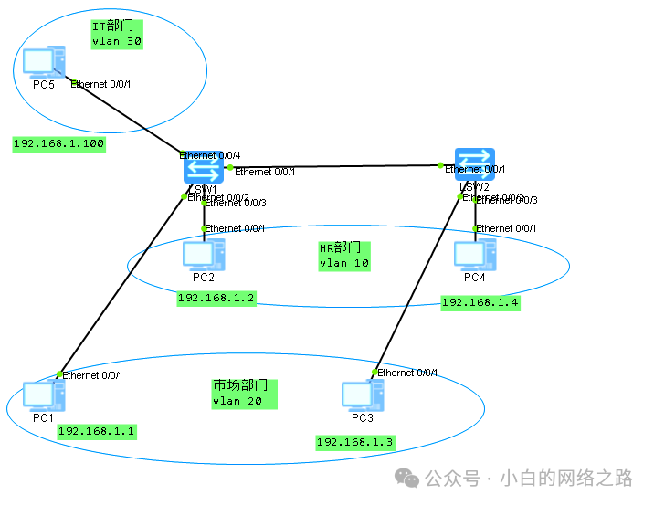
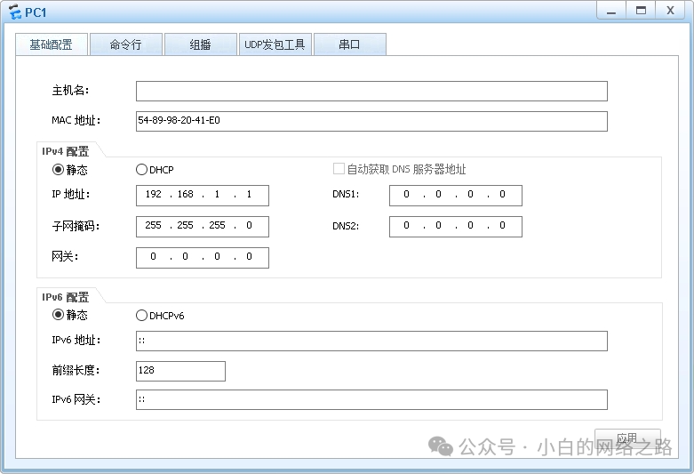
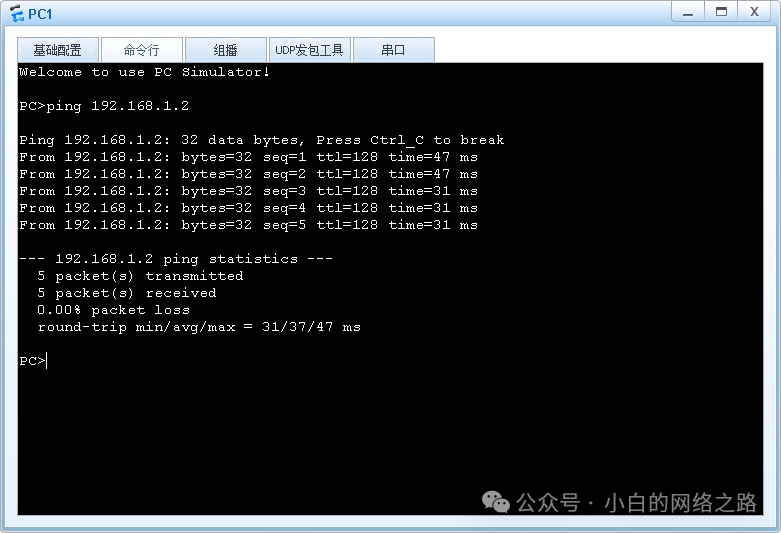
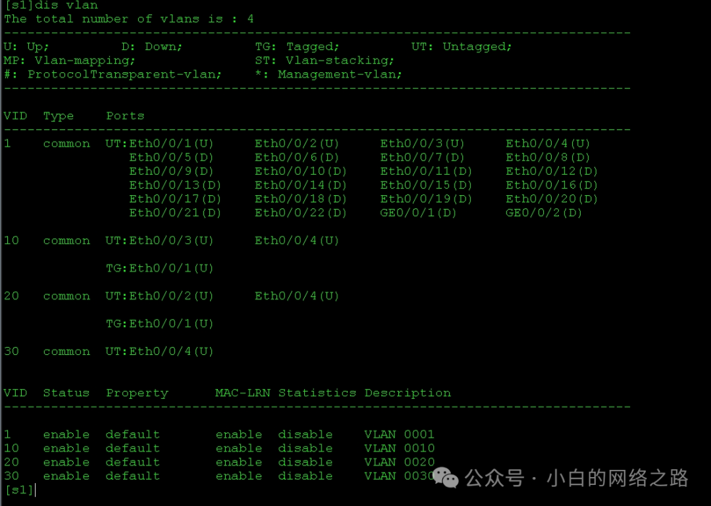
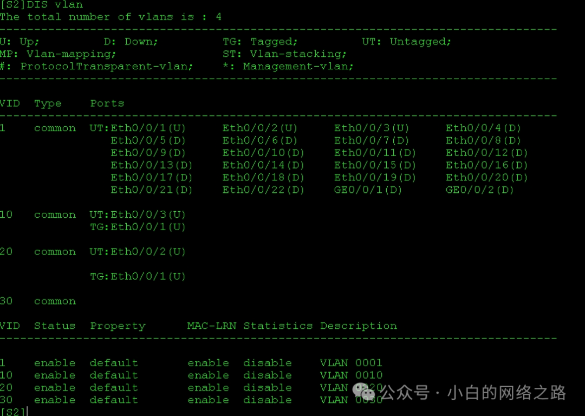
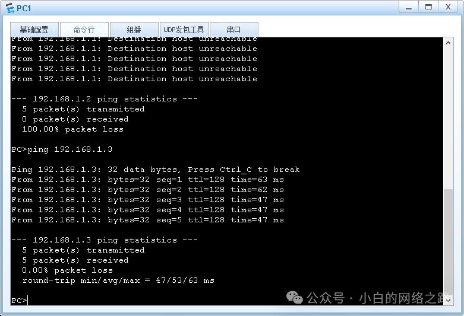
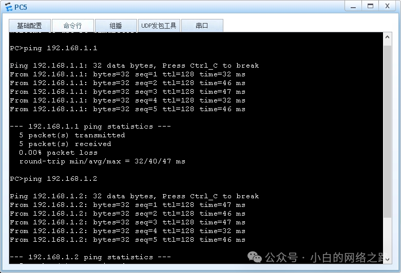

关于本实验的所需要的知识点补充

***\*hybrid\**** **部分**

在华为交换机中，Hybrid 接口通常指的是支持同时传输多种不同协议或介质的接口。它是指在单个接口上可以同时支持不同类型的数据传输，比如同时支持以太网和光纤通信。

具体来说，在华为交换机中的 Hybrid 接口一般是指具备多种物理接口和传输方式的端口。这些接口可以同时支持不同速率、不同类型的数据传输，例如同时支持 Ethernet（以太网）和 Fiber Channel（光纤通道）的数据传输。

Hybrid 接口的设计使得华为交换机可以更灵活地适应各种网络需求，并提供更多样化的连接选项。通过配置 Hybrid 接口，网络管理员可以根据实际需求选择不同的物理介质和协议，以满足不同设备和应用之间的连接要求。

需要注意的是，Hybrid 接口的具体配置和功能可以因不同的华为交换机型号和软件版本而有所不同。因此，如果在具体的华为交换机设备上使用 Hybrid 接口，建议参考相应的设备文档或联系华为技术支持获取更准确和详细的信息。

在华为交换机中，Hybrid 接口具有以下作用：

> 1. 多协议支持：Hybrid 接口可以同时支持多种不同的协议，如以太网、光纤通道（Fiber Channel）等。这样可以满足网络中的不同设备和应用之间的协议要求，实现灵活的数据传输。
>
>    
>
> 2. 多介质支持：Hybrid 接口可以同时支持不同的物理介质，如 RJ-45（铜缆）和光纤等。这样可以适应不同的网络环境和需求，实现灵活的网络连接。
>
>    
>
> 3. 弹性配置：通过配置 Hybrid 接口，可以根据实际需求选择合适的协议和介质，并灵活调整接口参数。这样可以根据网络的变化和要求来优化和调整接口的配置。
>
>    
>
> 4. 提高网络利用率：Hybrid 接口的多协议和多介质支持，使得网络设备可以更有效地利用资源。例如，可以通过 Hybrid 接口将不同类型的设备连接到同一个交换机上，从而简化网络拓扑结构，提高网络资源的利用效率。
>
>    

总之，Hybrid 接口在华为交换机中的作用是为了提供更灵活、可扩展和兼容的网络连接选项，以满足不同设备和应用之间的协议和介质要求，并提高网络资源的利用效率。

**/** 实验目的 **/**

- 掌握配置Hybrid 接口的方法
- 理解Hybrid 接口处理Untagged 数据帧过程
- 理解Hybrid 接口处理Tagged 数据帧过程
- 理解Hybrid 接口的应用场景

**/** 实验背景 **/**

某企业二层网络使用两台 S3700 交换机 S1 和 S2，且两台设备在不同的楼层。网络管理员规划了 3 个不同 VLAN，HR 部门使用 VLAN10，市场部门使用 VLAN 20，IT 部门使用 VLAN30。现在需要让处于不同楼层的 HR 部门和市场部门实现部门内部通信，而两部门之间不允许互相通信;IT 部门可以访问任意部门。可以通过配置 Hybrid 接口来实现较复杂的 VLAN 控制。

**/** 实验拓扑 **/**



**/** 实验任务配置 **/**

**IP 地址规划**

| 设备 | 接口   | 地址          | vlan |
| ---- | ------ | ------------- | ---- |
| PC1  | E0/0/1 | 192.168.1.1   | 20   |
| PC2  | E0/0/1 | 192.168.1.2   | 10   |
| PC3  | E0/0/1 | 192.168.1.3   | 20   |
| PC4  | E0/0/1 | 192.168.1.4   | 10   |
| PC5  | E0/0/1 | 192.168.1.100 | 30   |

**基本配置**






***\*其他主机间互相通信测试和上述相同\****

**创建 vlan**

```
[s1]vlan batch 10 20 30[s2]vlan batch 10 20 30
```

**配置 hybrid**

因为ensp接口类型默认是hybrid，下面我会提供的一些命令参考

```
port link-type hybrid
```

接口类型改为hybrid

S1的配置

```
[s1]int Eth 0/0/1[S1-Ethernet0/0/1]port hybrid tagged vlan 10 20[s1]int Eth 0/0/2[S1-Ethernet0/0/2]port hybrid untagged vlan 20[S1-Ethernet0/0/2]port hybrid pvid vlan 20[s1]int Eth 0/0/3[S1-Ethernet0/0/3]port hybrid untagged vlan 10[S1-Ethernet0/0/3]port hybrid pvid vlan 10
```

S2的配置

```
[S2]int Eth 0/0/1[S2-Ethernet0/0/1]port hybrid tagged vlan 10 20[s2]int Eth 0/0/2[S2-Ethernet0/0/2]port hybrid untagged vlan 20[S2-Ethernet0/0/2]port hybrid pvid vlan 20[S2]int Eth 0/0/3[S2-Ethernet0/0/3]port hybrid untagged vlan 10[S2-Ethernet0/0/3]port hybrid pvid vlan 10
```

配置完成后，使用display vlan命令查看使用Hybrid配置下接口和VLAN的对应关系。





***5\***

##   

**延伸部分
**

实现网管员对所有网络的访问在实现各部门内部终端可以互相访问，不同部门间的终端隔离访问后，要求网络管理员所在的 I 部门(使用终端 PC-5)能够实现对所有部门的访问。即要求实现 VLAN 30 访问 VLAN10 和 VLAN 20，VLAN 10 和 VLAN 20 之间仍然不允许互相访问。如果 S1 的 E 0/0/2 接口仍是 Access 类型且属于 VLAN10，则不能被其他 VLAN 访问。若要 VLAN 30 的终端能访问 VLAN 10 的终端，则需要修改接口的配置，使其既能被 VLAN 10 访问，又能被 VLAN 30 访问，这就要求此接口同时要属于多个 VLAN，且端口所连设备是 PC，不能识别带 VLAN Tag 的帧，故此时只能使用 Hybrid 类型接口。Hybrid 端口既能被加入多个 VLAN 中，又能够在将其余 VLAN 的帧转发到此接口时，剥离掉相应的 VLAN Tag。

S1的配置

```
[S1]int Eth 0/0/4[S1-Ethernet0/0/4]port hybrid pvid vlan 30[S1-Ethernet0/0/4]port hybrid untagged vlan 10 20 30[S1]int Eth 0/0/2[S1-Ethernet0/0/2]port hybrid untagged vlan 20 30[S1]int Eth 0/0/3[S1-Ethernet0/0/3]port hybrid untagged vlan 10 30[S1]int Eth 0/0/1[S1-Ethernet0/0/1]port hybrid tagged vlan 10 20 30
```

S2的配置

```
[S2]int Eth 0/0/1[S2-Ethernet0/0/1]port hybrid tagged vlan 10 20 30[S2]int Eth 0/0/2[S2-Ethernet0/0/2]port hybrid untagged vlan 20 30[S2]int Eth 0/0/3[S2-Ethernet0/0/3]port hybrid untagged vlan 10 30
```

**结果验证**






在交换机上可以定义多个 VLAN，每个 VLAN 都可以看做是一个广播域，通常情况下每个 VLAN 都会分配一个独立的 IP 网络，根据需要把相应主机所在的接口划入到指定的 VLAN 中，并配置相应的网络 IP 地址，VLAN 间通过路由来实现互相访问。这是较为常用的方法。但是相比于基于端口的 Hybrid 配置，三层路由方式则不够灵活，原因在于 VLAN 之间的访问控制要借助于路由设备来实现。而控制 VLAN 访问使用 Hybrid 接口则极大地简化了配置的复杂性，它仅需在端口上自主定义基于 VLAN Tag 的过滤规则，来决定指定的 VLAN 的二层帧是否允许发送;它是通过二层来实现 VLAN 间的访问控制，既不需要每个 VLAN 定义单独的 IP 网段，更不需要在 VLAN 间引入路由设备，配置更为灵活方便。


**本文完**
