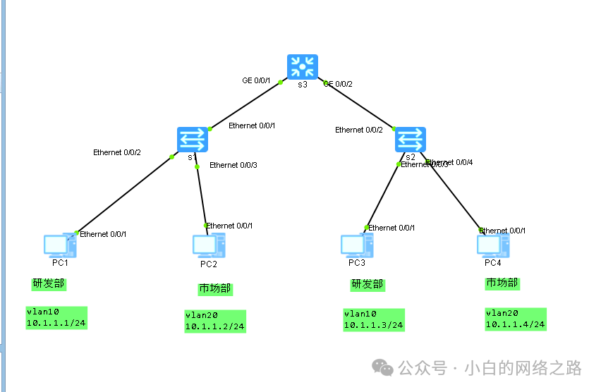
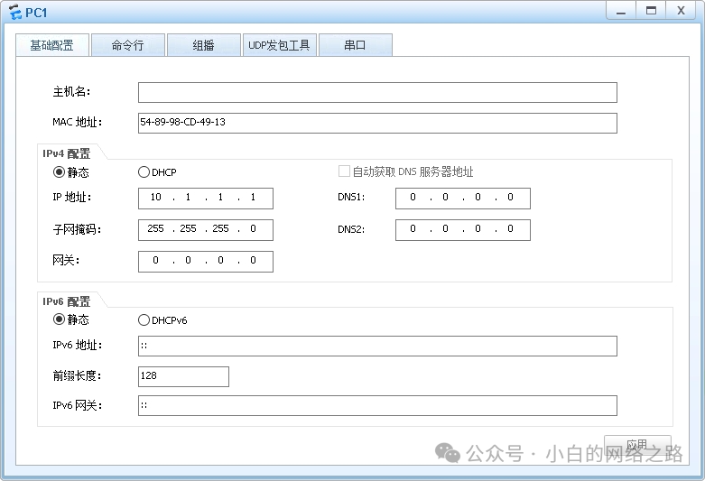
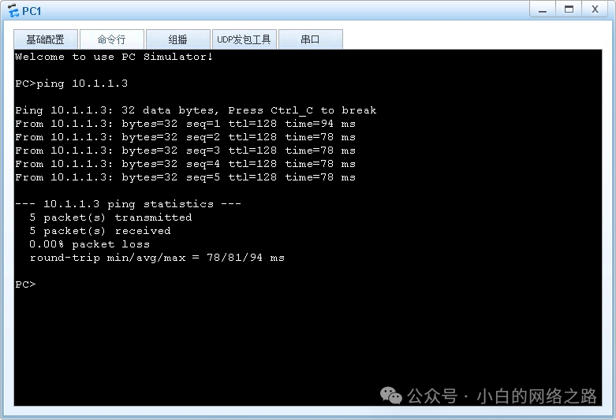

## 实验介绍
关于本实验的所需要的知识点补充
### trunk部分
VLAN 传输：trunk 端口可以传输多个 VLAN 的数据。它使用 VLAN 标记协议（如 IEEE 802.1Q）来在数据包中添加 VLAN 标记，以标识数据包属于哪个 VLAN。

配置方式：trunk 端口需要在交换机上进行配置。管理员需要将相应的端口配置为 trunk 端口，并指定所传输的 VLAN 列表。这样交换机才能正确地进行 VLAN 标记和数据转发。

连接交换机：trunk 端口通常用于连接两个交换机之间的接口。通过这样的连接，交换机可以交换多个 VLAN 的数据，并提供灵活性和效率。

数据传输：当数据从一个交换机通过 trunk 端口发送到另一个交换机时，发送端交换机会在数据包的以太网帧中添加 VLAN 标记，以标识数据包所属的 VLAN。接收端交换机会根据 VLAN 标记将数据包转发到相应的 VLAN。

需要注意的是，trunk 端口一般不用于连接终端设备（如计算机或打印机），而是用于连接交换机之间的接口，以实现多个 VLAN 的数据传输。总结起来，trunk 端口是在交换机上配置为传输多个 VLAN 数据的接口。它通过 VLAN 标记协议在数据包中添加 VLAN 标记，并允许交换机之间进行多个 VLAN 的数据传输。
### 实验目的
- 理解干道链路的应用场景
- 掌握 Trunk 端口的配置
- 掌握 Trunk 端口允许所有 VLAN 通过的配置方法
- 掌握 Trunk 端口允许特定 VLAN 通过的配置方法
### 实验背景
本实验模拟某公司网络场景。公司规模较大，员工 200 余名，内部网络是一个大的局域网。公司放置了多台接入交换机 (如 S1 和 S2)负责员工的网络接入。接入交换机之间通过汇聚交换机 S3 相连。公司通过划分 VLAN 来隔离广播域，由于员工较多，相同部门的员工通过不同交换机接入。为了保证在不同交换机下相同部门的员工能互相通信需要配置交换机之间链路为干道模式，以实现相同 VLAN 跨交换机通信。
### 实验拓扑 

### 实验任务配置 
**IP 地址规划**

| 设备 | 接口   | IP地址/掩码 | 所属vlan |
| ---- | ------ | ----------- | -------- |
| PC1  | E0/0/1 | 10.1.1.1/24 | 10       |
| PC2  | E0/0/1 | 10.1.1.2/24 | 20       |
| PC3  | E0/0/1 | 10.1.1.3/24 | 10       |
| PC4  | E0/0/1 | 10.1.1.4/24 | 20       |


## 基本配置




**其他主机间互相通信测试和上述相同**

###   创建 vlan


公司内网需要通过VLAN 的划分来隔离不同的部门，需要在3台交换机S1、S2、S3上都分别创建VLAN10和VLAN 20，研发部员工属于VLAN10，市场部员工属于VLAN20。
```
[s1]vlan batch 10 20[s2]vlan batch 10 20[s3]vlan batch 10 20
```
### 配置 access 接口

在S1 上配置E 0/0/2 和E 0/0/3 为Access 接口，并划分到相应的VLAN

```
[s1-Ethernet0/0/2]port link-type access[s1-Ethernet0/0/2]port default vlan 10[s1-Ethernet0/0/3]port link-type access[s1-Ethernet0/0/3]port default vlan 20
```

在S2 上配置E 0/0/3 和E 0/0/4 为Access 接口，并划分到相应的VLAN。

```
[s2-Ethernet0/0/3]port link-type access[s2-Ethernet0/0/3]port default vlan 10[s2-Ethernet0/0/4]port link-type access[s2-Ethernet0/0/4]port default vlan 20
```

### 配置 trunk 接口

为了让交换机间能够识别和发送跨越交换机的VLAN报文，需要将交换机间相连的接口配置成为Trunk接口。配置时要明确被允许通过的VLAN，实现对VLAN流量传输的控制。

在S1上配置E 0/0/1为Trunk 接口，允许VLAN 10 和VLAN20通过


```
[s1]int eth 0/0/1[s1-Ethernet0/0/1]port link-type trunk[s1-port-group-link-type]port trunk allow-pass  vlan 10 20
```

在S2上配置E 0/0/2为Trunk 接口，允许VLAN 10 和VLAN20通过


```
[s2]int eth 0/0/2[s2-Ethernet0/0/2]port link-type trunk[s2-Ethernet0/0/2]port trunk allow-pass  vlan 10 20
```

在S3上配置GE 0/0/1 和GE 0/0/2 为Trunk 接口，允许所有VLAN 通过

```
[s3]int g 0/0/1[s3-GigabitEthernet0/0/1]port link-type trunk[s3-GigabitEthernet0/0/1]port trunk allow-pass  vlan 10 20[s3-GigabitEthernet0/0/1]int g 0/0/2[s3-GigabitEthernet0/0/2]port link-type trunk[s3-GigabitEthernet0/0/2]port trunk allow-pass vlan 10 20
```
### 查看trunk 配置情况


## 检查配置结果**





**本文完**
