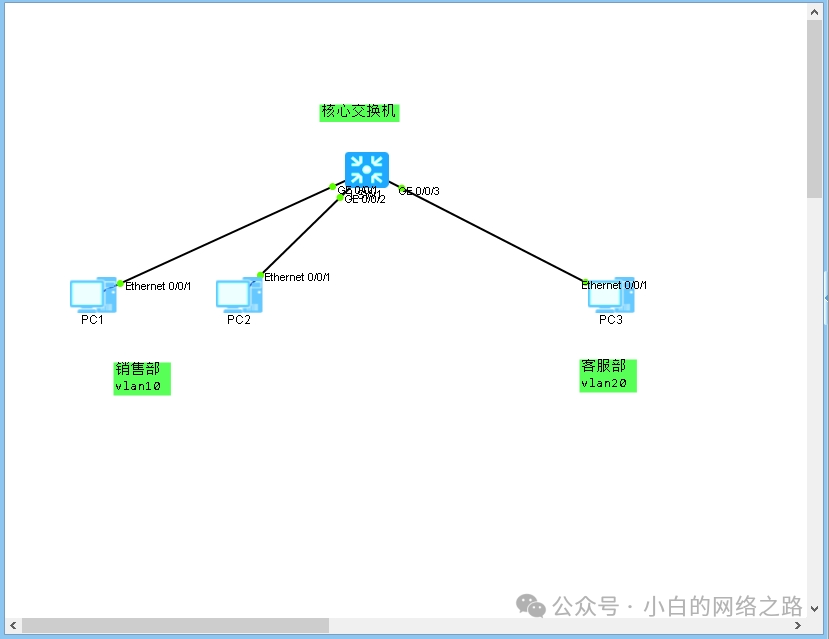
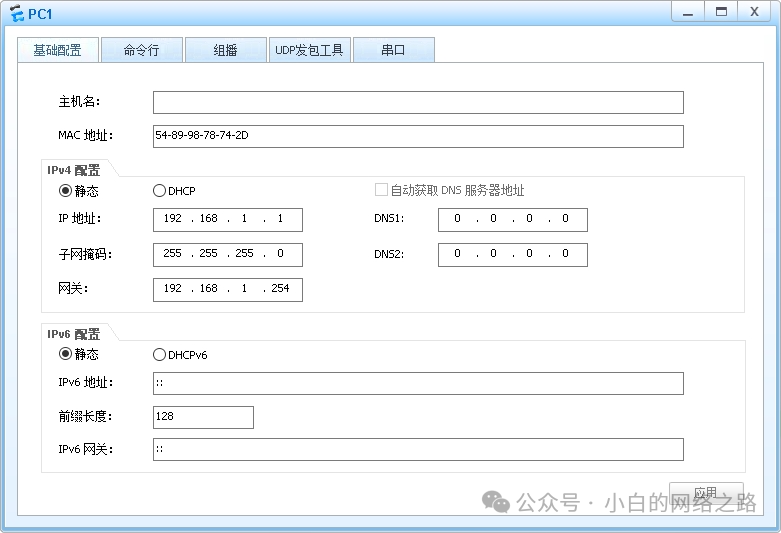
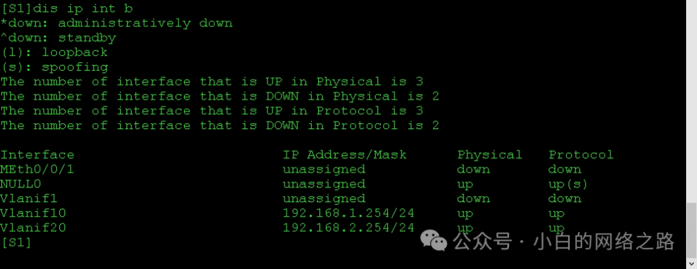
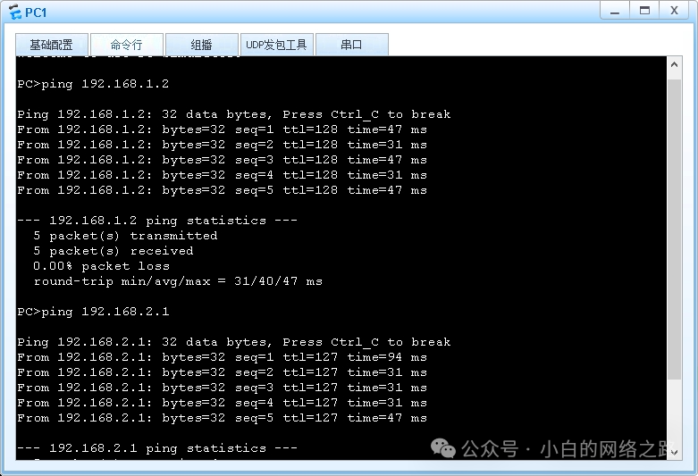

## 实验介绍

### 关于本实验的所需要的知识点补充

**vlanif**

VLANIF（Virtual Local Area Network Interface）是一种虚拟局域网接口，它是基于 VLAN 技术的扩展。在网络中，VLAN 是一种将局域网划分成多个虚拟局域网的技术，可以在单个物理网络中实现逻辑上的隔离和划分。而 VLANIF 就是在每个虚拟局域网中创建的一个虚拟接口，用于与该虚拟局域网内的设备进行交互和通信。VLANIF 接口可以配置 IP 地址和其他网络参数，实现虚拟局域网中的互联和通信功能。它在网络中起到连接不同 VLAN 之间的桥梁作用，可以将不同的 VLAN 划分成多个子网，并提供路由功能，实现不同子网之间的通信。

VLANIF 之间的路由是指不同 VLANIF 接口之间进行网络路由的过程。在一个网络中，每个 VLANIF 接口都代表一个虚拟局域网，而这些虚拟局域网可能存在跨网段的通信需求。为了实现不同 VLANIF 之间的通信，需要进行路由配置。

在路由器或三层交换机上，需要创建虚拟接口并将其分配给相应的 VLAN。这些虚拟接口通常称为 SVI（Switched Virtual Interface），每个 SVI 与一个 VLAN 关联。通过在 SVI 上配置 IP 地址和子网掩码，可以为每个 VLAN 创建一个虚拟网关。

当数据包从一个 VLANIF 接口发送到另一个 VLANIF 接口时，数据包首先到达路由器或三层交换机上的 SVI 接口。然后，根据路由表中的路由信息，决定数据包应该被发送到哪个目标 VLANIF 接口。

通过在路由器或三层交换机上配置适当的路由策略和路由协议，可以实现 VLANIF 之间的互联和通信。这样，不同 VLAN 中的主机就可以通过 VLANIF 之间的路由进行互相访问和通信。

### 实验目的 

1. 掌握配置VLANIF接口的方法
2. 理解数据包跨VLAN路由的原理
3. 掌握测试多层交换网络连通性的方法

###  实验内容

本实验模拟企业网络场景。公司有两个部门--销售部和客服部，分别规划使用VLAN 10和VLAN20。其中销售部下有两台终端PC-1和PC-2，客服部下有一台终端PC-3。所有终端都通过核心三层交换机S1相连。现需要让该公司所有三台主机都能实现互相访问，网络管理员将通过配置三层交换机来实现。

### 实验拓扑



### 实验编址

<table>
	<tr>
		<th>设备</th>
		<th>接口</th>
		<th>IP地址/掩码</th>
		<th>网关</th>
	</tr>
	<tr>
		<th>PC1</th>
		<td>E0/0/1</td>
		<td>192.168.1.1/24</td>
		<td>192.168.1.254</td>
	</tr>
	<tr>
		<th>PC2</th>
		<td>E0/0/1</td>
		<td>192.168.1.2/24</td>
		<td>192.168.1.254</td>
	</tr>
	<tr>
		<th>PC3</th>
		<td>E0/0/1</td>
		<td>192.168.2.1/24</td>
		<td>192.168.2.254</td>
	</tr>
	<tr>
		<th rowspan = "4">S1</th>
	</tr>
		<tr>
			<td>VLANIF10</td>
			<td>192.168.1.254</td>
		</tr>
		<tr>
			<td>VLANIF20</td>
			<td>192.168.2.254</td>
		</tr>
</table>


## 基本配置




### 其他操作

配置三层交换机实现VLAN间通信通过在交换机上设置不同的VLAN使得主机实现相互隔离。在三层交换机S1上创建VLAN10和VLAN 20，把销售部的主机全部划入VLAN 10 中，客服部的主机划入VLAN 20 中。

```

[S1]vlan 10

[S1-vlan10]vlan 20

[S1-vlan20]interface GigabitEthernet0/0/1

[S1-GigabitEthernet0/0/1]port link-type access

[S1-GigabitEthernet0/0/1]port default VLAN 10

[S1-GigabitEthernet0/0/1]interface GigabitEthernet0/0/2

[S1-GigabitEthernet0/0/2]port link-type access

[S1-GigabitEthernet0/0/2]port default VLAN 10

[S1-GigabitEthernet0/0/2]interface GigabitEthernet0/0/3

[S1-GigabitEthernet0/0/3]port link-type access

[S1-GigabitEthernet0/0/3]port default VLAN 20
```

在S1上使用 interface VLANif命令创建 VLANIF 接口，指定VLANIF 接口所对应的 VLAN ID 为10，并进入 VLANIF 接口视图，在接口视图下配置IP 地址192.168.1.254/24。再创建 对应 VLAN 20 的VLANIF 接口，地址配置为192.168.2.254/24。

```

[S1]interface VLANif 10

[S1-VLANif10]ip address 192.168.1.254 24

[S1-VLANif10]interface VLANif 20

[S1-VLANif20]ip address 192.168.2.254 24
```

配置完成后，查看接口状态。



## 结果验证



可见通信正常，实现了销售部终端与客服部终端间的通信。PC-2上的测试省略。

**本文完**
